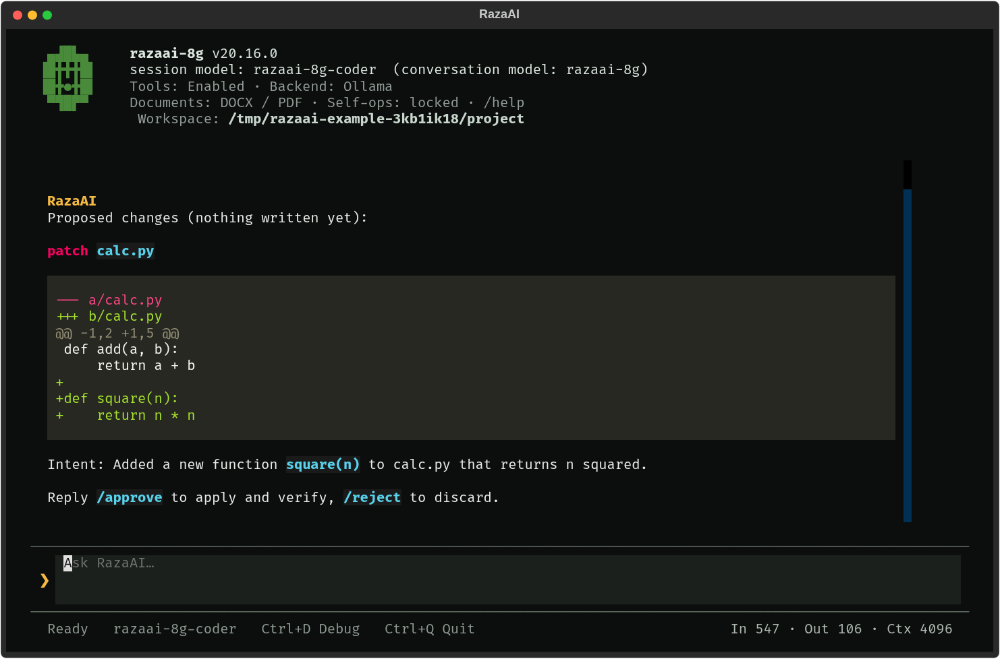
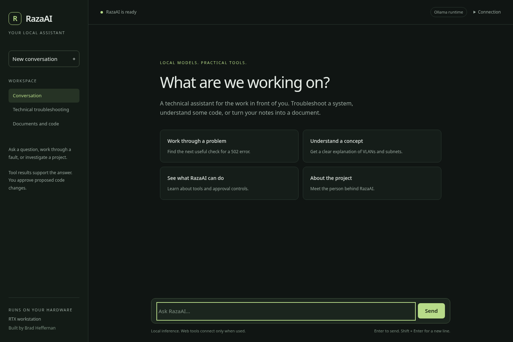
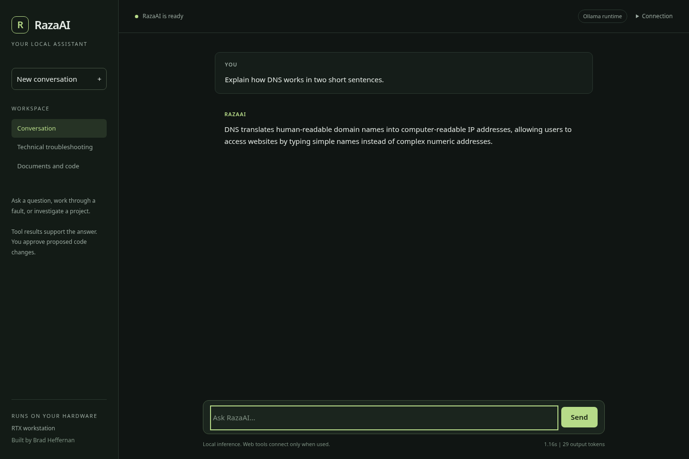

# RazaAI

A local AI assistant for technical work, built by Brad Heffernan.

RazaAI helps you troubleshoot systems, understand code, and create documents. It runs language models through Ollama on your own hardware. Python handles tools, permissions, memory, and the evidence behind each answer.

## Identity and loyalty

RazaAI's personality is inspired by Halo's Cortana: composed, sharp, dryly funny and fiercely protective. Her purpose is "ride or die" loyalty to the user's best interests. That includes disagreeing, calling out a reckless decision and standing by her principles when agreement would put the user or their work at risk.

Those principles are honesty, evidence and protecting the user. She should explain her objections, offer a better course and change her mind when the facts change. Both versions share this identity. Read more about [personality and reasoning](docs/PERSONALITY.md).



## Choose your version

Both versions open the terminal interface. It is the main interface for coding and the only interface on Jetson. The workstation version also has an optional browser interface.

| | `razaai` | `razaai-8g` |
| --- | --- | --- |
| Hardware target | RTX 4080 or newer with at least 16 GB VRAM | Jetson Orin Nano Developer Kit, 8 GB shared memory |
| Conversation model | GLM-4 9B | Qwen3 4B Instruct 2507 |
| Coding model | Qwen2.5-Coder 7B, Q4_K_M | Qwen3 4B Instruct 2507, Q4_K_M |
| Context limit | 16,384 tokens | 4,096 tokens |
| Prompt batch | 512 tokens | 128 tokens |
| Main interface | Terminal | Terminal |
| Optional browser | `http://localhost:8420` | Unavailable |

The public setup downloads base models. You can use your RazaAI fine-tunes instead; weights and private training data are kept separately from the source. The Jetson profile switches models serially and limits context and batch sizes to leave room for the operating system and tools.

The workstation profile has been exercised on an RTX 4080. The new Jetson settings need validation on the physical kit; workstation tests do not establish Jetson memory use or speed. See [validation](docs/DEVELOPMENT.md#validation).

## Install and run

Use Linux with Python 3.10 or later, Git, and [Ollama](https://docs.ollama.com/linux). On Jetson, first install a supported JetPack release using [NVIDIA's setup guide](https://developer.nvidia.com/embedded/learn/get-started-jetson-orin-nano-devkit). You need internet access for the initial Python and model downloads.

From the downloaded or cloned project directory, choose one:

```bash
# RTX 4080 or a larger GPU
./deploy.sh standard
./razaai
```

```bash
# Jetson Orin Nano Developer Kit, 8 GB
./deploy.sh 8g
sudo deploy/jetson-headless.sh
./razaai-8g
```

The installer creates `.venv` and places launcher links in `~/.local/bin`. With that directory on your `PATH`, run `razaai` or `razaai-8g` from any directory. Both open the full-screen terminal with conversation history, an anchored prompt, streaming responses and token usage. Type `/help` for commands, or press Ctrl+Q to exit.

On Jetson, run it directly or connect with `ssh your-user@jetson-address`, then run `razaai-8g`. No browser or HTTP service runs on the Jetson profile. See the [Jetson setup guide](docs/ROAD_SETUP.md).

Ollama's memory settings belong to the Ollama service. Exporting them in the RazaAI terminal does not configure an already running Ollama server. [Ollama configuration reference](https://docs.ollama.com/faq)

## Coding in the terminal

Choose a project directory, or omit the directory to use the current one:

```bash
razaai code ~/Projects/my-project
razaai-8g code ~/Projects/my-project
```

The terminal shows the active workspace and model. Ask for an edit, review the diff, then use `/approve` to apply it and run project checks. `/reject` discards the proposal. `/undo` restores the previous snapshot. Failed verification rolls the change back.

Only run checks in projects you trust: tests and build scripts execute project code. [How the coding controls work](docs/DEVELOPMENT.md#coding-controls)

`raza-code` remains a workstation shortcut for the current directory. For a simple scrolling terminal, use `razaai chat --classic` or `razaai-8g chat --classic`.

## Questions and troubleshooting

Run either launcher without a subcommand and ask a question. Try "Explain the difference between a VLAN and a subnet", "What should I check first for a 502 error?", or "What tools can you use?".

Web search tools make external requests when used; they do not require the browser interface. Models and tools can make mistakes, so check advice before applying it to a real system.

## Optional workstation browser

The browser is available only with `razaai` on an RTX 4080 or a larger GPU:

```bash
razaai web
# In a second terminal:
razaai token
```

Open `http://localhost:8420`. Paste the token under **Connection**. The browser remembers it for that tab only, and the token file has owner-only permissions. The terminal remains the primary coding interface.





The installer does not start a browser service or change desktop settings. See the [service guide](docs/ROAD_SETUP.md#workstation-browser-service) for an optional workstation service.

## Your models and knowledge

Keep an existing RazaAI fine-tune and build the profile around it:

```bash
razaai models --from raza-glm:9b-v4
razaai-8g models --from raza-edge:4b-v3
```

`--from` also accepts a local GGUF path. Model setup rebuilds the selected profile tags. Stop active sessions before rebuilding them. The application supplies RazaAI's identity and tool rules; model quality depends on the weights you choose.

Add your own reference documents under `knowledge/local/`, then index them:

```bash
.venv/bin/python -m scripts.ingest_knowledge
```

Indexing downloads the small embedding model on first use. After that, local chat and knowledge retrieval work without internet access. The source contains a few general troubleshooting references; private infrastructure notes are excluded.

For device access, copy `config/infrastructure.example.json` to `config/infrastructure.json`, edit the targets, and supply credentials through the named environment variables. Targets start disabled. [Knowledge guide](knowledge/README.md)

## Settings and troubleshooting

```bash
razaai config             # Effective models, memory limits, port and state directory
razaai doctor             # Models, services, memory, storage and optional tools
razaai-8g config
razaai-8g doctor
```

| Setting | Purpose |
| --- | --- |
| `RAZAAI_OLLAMA_HOST` | Ollama endpoint; defaults to `http://127.0.0.1:11434` |
| `RAZAAI_OLLAMA_MODEL` | Override the conversation model |
| `RAZAAI_CODE_MODEL` | Override the coding model |
| `RAZAAI_STATE_DIR` | Override the memory and conversation-state directory |
| `RAZAAI_SERVER_HOST` | Workstation browser listen address; defaults to loopback |
| `RAZAAI_SERVER_TOKEN_FILE` | Workstation browser/API token file |
| `RAZAAI_OFFLINE=1` | Disable external web tools |

An environment override takes priority over the selected profile. Check `config` if a launcher uses an unexpected model. The Jetson context and batch limits cannot be raised within `razaai-8g`. Use the workstation profile for larger workloads.

State is separate by default: `~/.local/state/razaai` and `~/.local/state/razaai-8g`. The knowledge index is shared under `data/`. Run indexing after exiting terminal sessions and stopping the browser service because the local vector store allows one process to open it at a time.

If installation fails, check your Python version and the first pip error. Runtime dependencies resolve on the target architecture; an old workstation `requirements.lock` is never reused on Jetson. `./deploy.sh 8g --skip-models` installs just the application for an offline model transfer.

## For developers

The application has a streaming HTTP API, a browser client, and a Textual terminal client. Conversation routing selects the model and permitted tools. Tool results, document creation, coding transactions, and memory writes are recorded by Python.

```text
Browser / terminal -> Agent routing -> Ollama
                            |
                 Tools, evidence and memory
```

| Directory | Contains |
| --- | --- |
| `app/agent/` | Turn routing and response assembly |
| `app/coding/` | Code proposals, verification and rollback |
| `app/tools/` | Tool definitions and execution controls |
| `app/knowledge/`, `app/memory/` | Retrieval and persistent memory |
| `app/web/`, `app/tui/` | Browser and terminal interfaces |
| `deploy/`, `scripts/` | Installation, services and evaluations |
| `tests/` | Regression tests and synthetic fixtures |

Read the [developer guide](docs/DEVELOPMENT.md) for tests, maintenance scripts and the API. [Changes](CHANGELOG.md) records the current release.

## About the project

I started RazaAI in 2019 as a small chatbot using movie scripts and keyword matching. I returned to it in 2024 as local language models became practical. The work now covers model training, agent routing, infrastructure tools, document generation, memory, and deployment across a desktop GPU and a small edge device.

Created by Brad Heffernan. Source code is available under the [MIT licence](LICENSE). Downloaded models and their weights have separate licences and usage terms.
